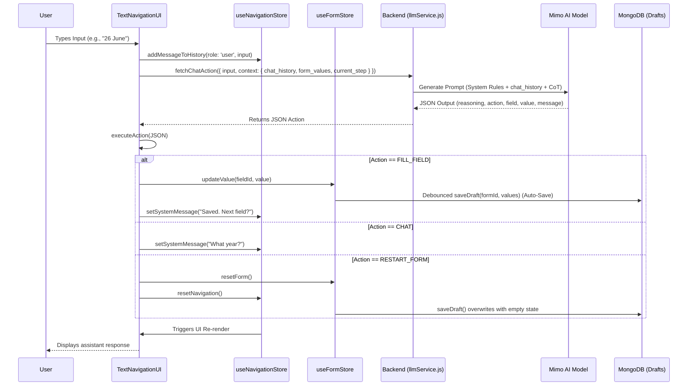

# Parallax: Accessibility-First Digital Inclusion

## Problem Statement

For millions of people in India, accessing essential digital services is still a major challenge. Applying for a government scheme, filling out a form, or even finding the right information often requires users to read complex interfaces, understand unfamiliar terminology, type accurately, and navigate multiple steps on their own.

For a visually impaired user, a form may be difficult to navigate. For someone who is not comfortable with English, understanding the instructions can become a barrier. For users with limited digital literacy or motor impairments, even simple tasks like finding the right button, entering information, or uploading the correct document can become frustrating or impossible.

The problem is not that these services are unavailable digitally. The problem is that they are designed around how a typical user is expected to interact with technology.

Accessibility should go beyond adding larger text support. The digital experience itself needs to adapt to the user. This is the problem Parallax aims to solve by making essential digital services voice driven, multilingual, document-aware, and simplFe enough to use without requiring prior digital literacy.

## Our Solution: Parallax

**Parallax** is an accessibility-first navigation engine that changes how people interact with digital services. Instead of expecting users to understand complex forms, menus, and dense interfaces, Parallax adapts the experience to the user.

The platform focuses on government services and uses a **Voice-First Navigation** to guide users through complete workflows using natural conversation in their preferred language. Users can talk to the system, scan their documents, and listen to instructions without needing to understand how the underlying website works.

To demonstrate the solution with realistic use cases, I built and simulated **three commonly used government application workflows**. Parallax helps users navigate these forms step by step, understand what information is required, automatically fill fields using voice or documents, and get guidance throughout the process.

The goal is simple: make essential digital services easier to access for people who may struggle with traditional web interfaces, regardless of their digital literacy, language, or ability.

## Key Features

1. **Multilingual Voice Navigation**
    - Users can interact with the platform completely hands-free by speaking naturally in their preferred Indian languages. The AI acts like a human guide, prompting for details step by step, understanding conversational intent, and automatically filling out the form fields.

2. **Smart Document Autofill and Verification**
    - This eliminates the need to type out lengthy details. Users can just upload or scan a document like an Aadhaar Card or Marksheet using their camera. Our Vision AI automatically extracts the required fields in English and instantly verifies if the correct type of document was uploaded.

3. **Document Scan Assistance**
    - Scanning documents can be frustrating for visually impaired users or those who are not used to smartphones. Parallax provides real-time verbal assistance during the scanning process. If a document is blurry, cut off, or the wrong type, the AI provides immediate and polite audio feedback explaining the exact issue and guiding the user to try again. This ensures a smooth and frustration-free experience.

4. **Zero-Cognitive Load UI Control**
    - Users do not need to hunt for buttons or understand complex routing. The AI completely manages the interface by transitioning between steps, focusing on specific fields, and summarizing submitted applications. Everything is driven entirely by conversational commands.

5. **Soft Minimalism and High-Contrast Design**
    - For users who prefer or need manual interaction, the UI is built strictly around accessibility guidelines. It uses the highly readable Atkinson Hyperlegible Next typeface, heavy tactile buttons, high-contrast colors like Deep Teal and Charcoal, and a soft minimalist layout to reduce glare and visual clutter.

## Tech Stack

- **Frontend**: Next.js, React, Tailwind CSS, Zustand (State Management).
- **Backend**: Node.js, Express, MongoDB (Mongoose).
- **AI & ML**: Gemini FLash LLM, Sarvam API (Multilingual Text-to-Speech Translation), Tesseract OCR (Optical Character Recognition).
- **Accessibility & Voice**: Web Speech API (Speech Recognition), Sarvam API (Multilingual Text-to-Speech).

## 🏗 Architecture Diagram

## Getting Started

### Prerequisites

- Node.js (v18+)
- MongoDB instance running

### Installation

1. Clone the repository
2. Navigate to the frontend directory, install dependencies and start the client:
   \`\`\`bash
   cd frontend
   npm install
   npm run dev
   \`\`\`
3. Navigate to the backend directory, configure \`.env\`, install dependencies and start the server:
   \`\`\`bash
   cd backend
   npm install
   npm run dev
   \`\`\`
