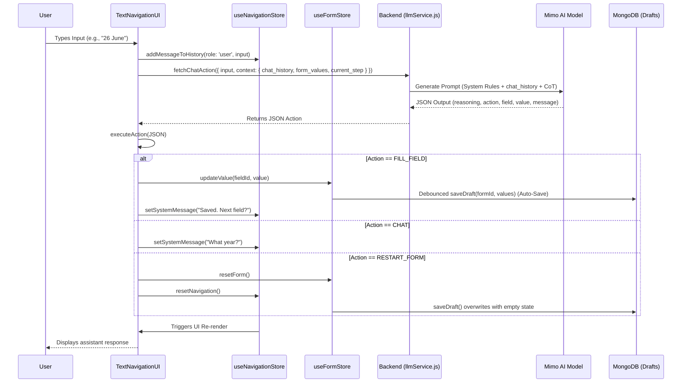

# Parallax: Accessibility-First Digital Inclusion

Welcome to the Parallax repository! This project is built to dismantle the barriers of the modern web and create a truly inclusive digital experience for everyone.

## Problem Statement Breakdown
Millions of individuals across India are digitally excluded because of visual, hearing, motor, or cognitive impairments, language barriers, or simply a lack of digital literacy. Most modern websites and applications are built with the assumption of an "average" user—someone who can easily read complex English menus, type quickly, and visually process dense screen layouts. 

This assumption creates severe barriers. For marginalized users, everyday tasks like applying for government services, accessing healthcare, or navigating education platforms become incredibly difficult or entirely impossible. The challenge is to design an inclusive, innovative solution that dismantles these barriers, creating an intuitive, dignified, and fully accessible digital experience for everyone, regardless of their abilities, language, or background.

## Our Solution: Parallax
**Parallax** is an accessibility-first navigation engine designed to completely flip the traditional web interaction model. Instead of forcing users to learn and adapt to rigid forms, complex UI layouts, and dense text, Parallax adapts to the user. 

Focusing on the domain of Government Services, Parallax features an intelligent, Voice-First dialogue manager that guides users through complex workflows—such as applying for a National Scholarship—entirely through natural conversation in their native language. It empowers users to talk, scan, and listen their way through the web, delivering a zero-cognitive load experience that requires absolutely no digital literacy to operate.

## Key Features

1. **Multilingual Voice-First Navigation**
   - Users can interact with the platform entirely hands-free by speaking naturally in their preferred Indian languages (such as Kannada, Hindi, etc.). The AI acts as a human-like guide, prompting for details step-by-step, interpreting conversational intent, and automatically filling out the fields.

2. **Smart Document Autofill & Verification (Vision AI)**
   - Eliminates the need to type lengthy details. Users can simply upload or scan a document (e.g., Aadhaar Card, Marksheet) using their device camera. The Vision AI automatically extracts the required fields in English and instantly verifies if the correct document type was uploaded.

3. **Document Scan Assistance**
   - For visually impaired users or those unaccustomed to smartphones, scanning documents can be frustrating. Parallax provides real-time verbal assistance during the scanning process. If a document is blurry, cut off, or the wrong type (e.g., scanning a Marksheet instead of an Income Certificate), the AI provides immediate, polite audio feedback explaining the exact issue and guiding the user to retry, ensuring a frustration-free experience.

4. **Zero-Cognitive Load UI Control**
   - Users do not need to hunt for buttons or understand complex routing. The AI completely manages the interface—transitioning between steps, focusing on specific fields, and summarizing submitted applications—all driven by conversational commands.

5. **Accessible Information Board**
   - Government schemes and critical updates are natively translated into the user's selected language. They feature integrated Text-To-Speech (TTS) readouts, ensuring that users with low literacy or severe visual impairments can easily consume information.

6. **Soft Minimalism & High-Contrast Design**
   - For users who prefer or need manual interaction, the UI is built strictly around accessibility guidelines. It uses the Atkinson Hyperlegible Next typeface, heavy tactile buttons, high-contrast coloring (Deep Teal and Charcoal), and a soft minimalist layout to reduce glare and visual clutter.

## Tech Stack
- **Frontend**: Next.js, React, Tailwind CSS, Zustand (State Management), Lucide React (Icons).
- **Backend**: Node.js, Express, MongoDB (Mongoose).
- **AI & ML**: MIMO v2.5 LLM (Dialogue Manager & Vision Extraction), Sarvam API (Multilingual Text-to-Speech Translation), Tesseract OCR (Optical Character Recognition fallback).
- **Accessibility & Voice**: Web Speech API (Speech Recognition), Sarvam API (Multilingual Text-to-Speech), Custom Audio Pipeline for seamless conversational TTS.

## Resources & Documentation
- **System Prompts**: The core LLM prompts driving the dialogue manager and Vision AI extraction are documented in [SYSTEM_PROMPTS.md](./SYSTEM_PROMPTS.md).
- **Solution Document**: The detailed solution mapping is available in [SOLUTION.md](./SOLUTION.md).

## 🏗 Architecture Diagram

## Getting Started

### Prerequisites
- Node.js (v18+)
- MongoDB instance running

### Installation

1. Clone the repository
2. Navigate to the frontend directory, install dependencies and start the client:
\`\`\`bash
cd frontend
npm install
npm run dev
\`\`\`
3. Navigate to the backend directory, configure \`.env\`, install dependencies and start the server:
\`\`\`bash
cd backend
npm install
npm run dev
\`\`\`
